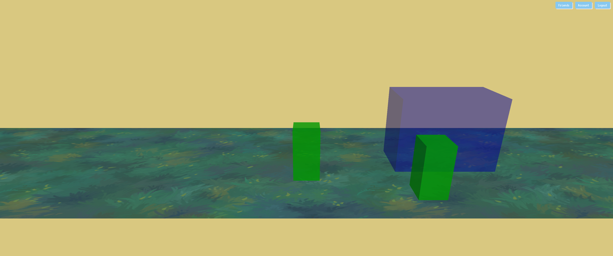
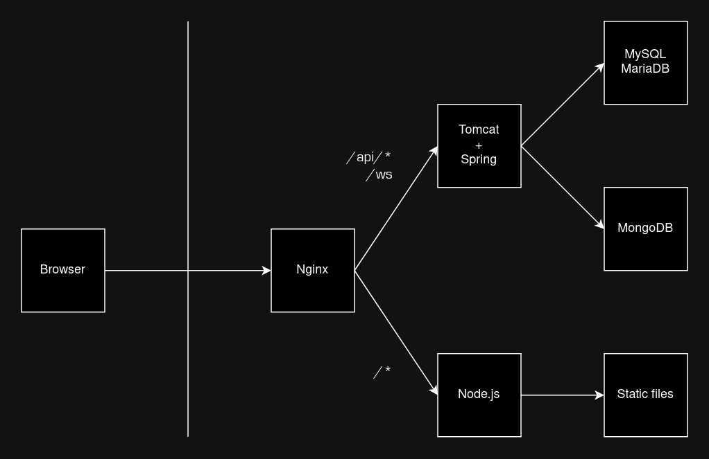

# Pixels

*This project is under active development. The game has shifted quite a bit
from its original concept and will likely continue to do so.*

A real-time social multiplayer game, designed and built from the ground up.

Screenshot (2023-08-03):


## Back-end

The back-end is built with the Spring framework (Java) with support for HTTP and
WebSockets.

### Overview



There are two servers running; one serves static resources (e.g. HTML) and the
other handles API invocations. The two servers are fused into a single point of
contact for clients with the use of a reverse proxy (Nginx). This not only
simplifies endpoint management from the perspective of the client but also makes
cross-origin concerns easier. The origin for all things related to this project
would be the public domain or address of the Nginx instance.

### HTTP API

Authentication can be included in either the `Authorization` header as a
`Bearer` token or the `X-Authorization` cookie as a standalone string. Both use
the same token from the server's response to a successful `/api/login` call.
These are omitted from the sample requests below for brevity.

For unsuccessful requests, the server will respond with the appropriate status
code to indicate the cause of failure (e.g. 409 for an attempt to create an
account with an existing username). These are also omitted here for brevity.

---

**Login via username and password**

```
POST /api/auth

{
  "username": "somebody",
  "password": "somesecret"
}
```

```
200
Set-Cookie: X-Authorization=O2vIi4gkS1fDMDCM5IwGX2CM4UvFeFoVB5QTQ5k74tOE0YMIyNBbrW09GUAXTHnp0YKvGk3OiXuky5AkFv8sjdU5bgsxNSddiHQIcnHsrkx1aHJ8AzLhGetLBGB6BPri

{
  "token": "O2vIi4gkS1fDMDCM5IwGX2CM4UvFeFoVB5QTQ5k74tOE0YMIyNBbrW09GUAXTHnp0YKvGk3OiXuky5AkFv8sjdU5bgsxNSddiHQIcnHsrkx1aHJ8AzLhGetLBGB6BPri"
  "creationTime": 1691116911972,
  "expirationTime": 1691203311972
}
```

Authorization policy: Public

If the client is already logged in, the token received via the request will be
sent back unmodified via the response. This does not extend the lifetime of the
token.

---

**Logout**

```
DELETE /api/auth
```

```
200
```

Authorization policy: Public

The server will unconditionally respond with status code 200.

---

**Fetch account information**

```
GET /api/account?id=8
```

```
200

{
  "id": 8,
  "loginName": "somebody",
  "authorities": 1,
  "publicName": "Some person"
}
```

Authorization policy: Public (with filtering)

The `loginName` and `authorities` fields are included only if the requesting
client is either logged in as the requested account or an admin.

---

**Create account**

```
POST /api/account

{
  "loginName": "somebody",
  "password": "somesecret",
  "publicName": "Some person"
}
```

```
200

{
  "id": 8,
  "loginName": "somebody",
  "authorities": 1,
  "publicName": "Some person"
}
```

Authorization policy: Public

---

**Modify account**

```
PUT /api/account?id=8

{
  "loginName": "somebody",
  "password": "somesecret",
  "publicName": "Some person"
}
```

```
200

{
  "id": 8,
  "loginName": "somebody",
  "authorities": 1,
  "publicName": "Some person"
}
```

Authorization policy: Owner or admin

Only an admin can set the `authorities` field.

---

**Delete account**

```
DELETE /api/account?id=8
```

```
200
```

Authorization policy: Owner or admin

---

**List friends**

```
GET /api/friendship
```

```
200

{
  "incomingRequests": [
    {
      "creationTime": 1691127603717,
      "friendAccount": {
        "id": 9,
        "publicName": "Your stalker"
      }
    }
  ],
  "confirmedFriendships": [
    {
      "creationTime": 1691127243793,
      "friendAccount": {
        "id": 2,
        "publicName": "A close friend"
      }
    }
  ],
  "outgoingRequests": [
    {
      "creationTime": 1691127275020,
      "friendAccount": {
        "id": 7,
        "publicName": "Potential friend"
      }
    }
  ]
}
```

Authorization policy: Authenticated

---

**Request friendship**

```
POST /api/friendship?id=8
```

```
200
```

Authorization policy: Authenticated

This method is used to both request and accept a friendship. A confirmed
friendship is created when both parties request friendship for each other.

---

**Terminate friendship**

```
DELETE /api/friendship?id=8
```

```
200
```

Authorization policy: Authenticated

This method is used to remove an existing friendship, deny an incoming
friendship request, and cancel an outgoing friendship request.

---

### WebSocket API

Upon a successful login, the client immediately establishes a WebSocket
connection with the server. This connection is expected to persist for the
entire session. Outside of the HTTP APIs listed above, this single WebSocket
connection is used for all communication between the server and client. As such,
each message must specify the purpose it serves, as there is only one generic
`/ws` endpoint. Server-to-client and client-to-server scenarios have separate
sets of message types.

All messages are in JSON format, with the `type` field specifying its purpose
and the `payload` field holding information specific to the event, if any.

The server will deny any WebSocket connection attempt that does not contain
valid authentication, and it will drop any existing connection if the token
used for its authentication is terminated (via logout or expiration). Thus, once
the connection is established, there is no need for further authentication.

---

Server-to-client: **Friendship event**

```
{
  "type": "friendships_change"
}
```

The server sends this message on every possible type of friendship event,
including ones caused by the client. For example, a client that requests a new
friendship will immediately receive this event. This may seem unncessary, as
the client is already aware of any action that it has triggered, but this allows
the UI (i.e. friends list) to remain simple and respond to this message only, as
opposed to having to handle both incoming events from the server and UI actions.

---

Server-to-client: **Game snapshot**

```
{
  "type": "game_snapshot",
  "payload": {
    "clientPlayerId": 4,
    "snapshotTime": 1691131636384,
    "space": {
      "width": 64,
      "height": 8
    },
    "characters": {
      "10670328": {
        "id": 10670328,
        "playerId": 4,
        "width": 1,
        "height": 1,
        "posX": 27.821,
        "posY": 5.1973,
        "movementSpeed": 1,
        "orientation": "up_left",
        "moving": true
      }
    },
    "obstacles": [
      {
        "id": 8267213,
        "width": 5.5,
        "height": 2.2,
        "posX": 15,
        "posY": 4.5
      }
    ]
  }
}
```

This is by far the most complex message type, and it is subject to change as the
game evolves. It holds the most recent representation of the game's state. These
messages are sent rapidly at roughly 15 ms intervals (~66 Hz).

The `clientPlayerId` field specifies the player ID of the receiving client. Each
snapshot is catered to the receiving player, including and hiding the
appropriate information according to the rules of the game.

The `characters` field is a mapping of character IDs to character data. This
allows the client to quickly find data for a specific character (typically the
client's own character).

---

Server-to-client: **Account seat loss for game**

```
{
  "type": "game_seat_usurped"
}
```

Many devices can concurrently be logged in with the same account, but only one
session per account can be actively involved in the game. If a client is in-game
when a different client joins the game with the same account, the former will
receive this message. It serves as a notification that the client has
effectively been kicked from the game; no more game state updates will follow.

---

Server-to-client: **Game integrity violation**

```
{
  "type": "game_integrity_violation"
}
```

The server sends this message to a client when it detects an illegal game input
given the game's state at that point in time. For example, a character position
update claiming to be beyond a reasonable range from the last sync would cause
this event. It is functionally identical to the seat loss message, where the
client gets kicked from the game and stops receiving game state updates.

---

Client-to-server: **Join game**

```
{
  "type": "game_join"
}
```

The client sends this message to join the game. If a different session on the
same account is in-game, that one will be evicted. This client will start
receiving game state updates.

---

Client-to-server: **Game input**

```
{
  "type": "game_input",
  "payload": {
    "type": "position",
    "posX": 16.2193,
    "posY": 3.196285
  }
}
```

The client sends this message to indicate an in-game action. Similar to how
WebSocket messages indicate a type, this input message must specify a second
"inner" type, which describes the type of game action. However, unlike the
"outer" layer, the rest of the data is stored in the same level, as opposed to
in a nested `payload` field.

---

### Persistence

Data for sessions, accounts, and friendships is stored via MySQL (MariaDB).
Volatile game state data for connected players (e.g. character location) is
stored in-memory. Persistent player data (e.g. stats) is stored via MongoDB.

## Front-end

A single-page web app has been built to serve as the front-end for this game. It
uses [three.js](https://threejs.org/) for the game itself, but all other parts
of the UI are built with vanilla HTML, CSS, and JS.

An Android app or native C++/C# program are possible and interesting options for
the future, but these would be for much further down the line.

## Development status

The fundamental groundwork for the game is more or less complete.

- Systems are in place for authentication (custom bearer tokens and cookies),
account management, and friends (REST API).
- Bi-directional communication is possible between the server and client, and
both sides are able to send and receive game state updates.
- Collision detection is implemented on both the server and client. The client
generates new positions, and the server verifies every update to enforce game
integrity.
- Adjustable values such as character travel error margins and state sync
frequencies are still being ironed out as more testing happens.

In its current state, it's hard to call this a game, as there's nothing to do
besides walking around the field and marveling at the engineering. However, now
begins the fun and creative part! As ideas for the game get fleshed out, more
game-specific logic will be added.
